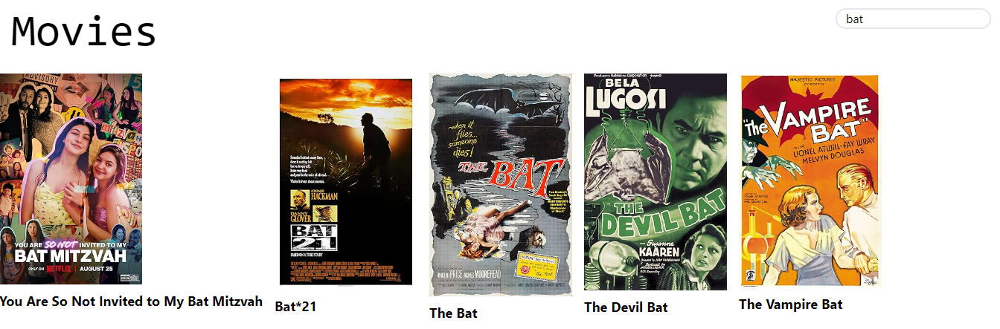
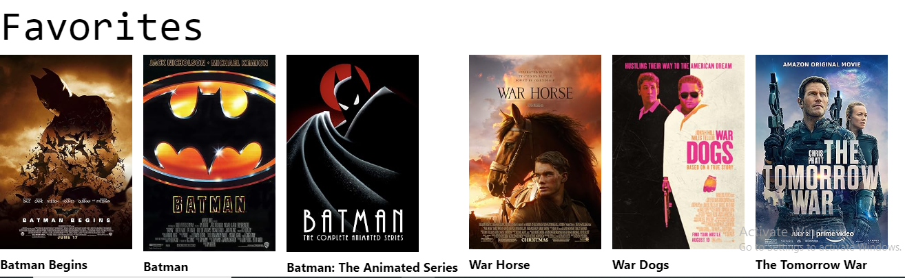

---
**Movie  App**

**Table of contents**
- [Project Description](#project-description)
- [Features](#features)
- [Demo](#demo)
- [Technologies Used](#technologies-used)
- [Installation](#installation)
- [Usage](#usage)
- [Contributing](#contributing)
- [License](#license)
- [Contact](#contact)
  

---

# Project Description
This project is a Movie Web Application developed using React and styled with Tailwind CSS. It allows users to effortlessly browse, search, and view various movies. The application utilizes an external API to fetch movie data, presenting it in an intuitive and user-friendly interface.

---

# Features
- **Browse Movies:** View an extensive list of popular and trending movies.  
- **Search Functionality:** Easily search for movies by title.  
- **Responsive Design:** Optimized for seamless use on both desktop and mobile devices.  

---

# Demo

---

# Technologies Used
- **React:** A JavaScript library for building interactive user interfaces.  
- **Tailwind CSS:** A utility-first CSS framework for rapid and efficient UI development.  
- **Node.js:** A JavaScript runtime built on Chrome's V8 engine, enabling server-side JavaScript.  
- **Movie API:** An external API that provides access to movie data.  

---

# Installation
To get started with the project, follow these steps:  
1. **Clone the repository:**  
   `git clone https://github.com/yourusername/yourproject.git`  
2. **Navigate to the project directory:**  
   `cd yourproject`  
3. **Install the dependencies:**  
   `npm install`  
_Don't forget  configuring tailwind in your local environment_ 

---

# Usage
- **Start the development server:**  
  `npm start`  
- Open [http://localhost:3000](http://localhost:3000) in your browser to view the application. The page will automatically reload whenever you make edits, and any lint errors will be displayed in the console.  

---

# Contributing
Contributions are welcome! Please follow these steps:  
1. **Fork the repository.**  
2. **Create a new branch:**  
   `git checkout -b feature-branch`  
3. **Make your changes and commit them:**  
   `git commit -m 'Add some feature'`  
4. **Push to the branch:**  
   `git push origin feature-branch`  
5. **Open a pull request.**  

---

# License
This project is licensed under the MIT License.  

---

# Contact
- **Email:** tesfamichaelalimaw@gmail.com
- **GitHub:** https://github.com/TesfamikaelAlmaw

---

